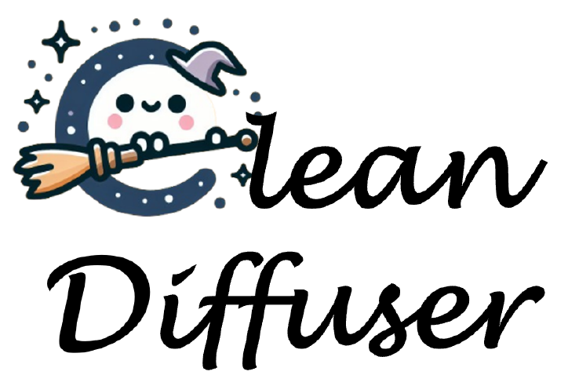
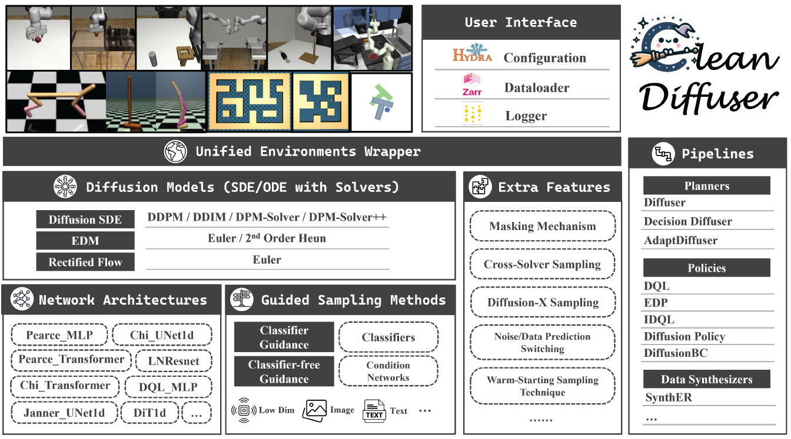

<!-- Improved compatibility of back to top link: See: https://github.com/othneildrew/Best-README-Template/pull/73 -->
<a name="readme-top"></a>
<!--
*** Thanks for checking out the Best-README-Template. If you have a suggestion
*** that would make this better, please fork the repo and create a pull request
*** or simply open an issue with the tag "enhancement".
*** Don't forget to give the project a star!
*** Thanks again! Now go create something AMAZING! :D
-->

<p align="center">
    <br>
    
    <br>
<p>

# CleanDiffuser: An Easy-to-use Modularized Library for Diffusion Models in Decision Making

<p align="center">
·
<a href="https://arxiv.org/abs/2406.09509">ArXiv</a>
·
<a href="assets/CleanDiffuser.pdf">Paper</a>
·
<a href="https://cleandiffuserteam.github.io/CleanDiffuserDocs/">Documentation</a>
·
</p>

**CleanDiffuser** is an easy-to-use modularized Diffusion Model library tailored for decision-making, which comprehensively integrates different types of diffusion algorithmic branches. CleanDiffuser offers a variety of advanced *diffusion models*, *network structures*, diverse *conditions*, and *algorithm pipelines* in a simple and user-friendly manner. Inheriting the design philosophy of [CleanRL](https://github.com/vwxyzjn/cleanrl) and [Diffusers](https://github.com/huggingface/diffusers), CleanDiffuser emphasizes **usability, simplicity, and customizability**. We hope that CleanDiffuser will serve as a foundational tool library, providing long-term support for Diffusion Model research in the decision-making community, facilitating the application of research for scientists and practitioners alike. The highlight features of CleanDiffuser are:

- 🚀 Amazing features specially tailored for decision-making tasks
- 🍧 Support for multiple advanced diffusion models and network architectures
- 🧩 Build decoupled modules into integrated pipelines easily like building blocks
- 📈 Wandb logging and Hydra configuration
- 🌏 Unified environmental interface and efficient dataloader

We strongly recommend reading [papers](https://arxiv.org/abs/2406.09509) and [documents](https://cleandiffuserteam.github.io/CleanDiffuserDocs/) to learn more about CleanDiffuser and its design philosophy.

<p align="center">
    <br>
    
    <br>
<p>

<!-- NEWS -->
## 🔥 News and Change Log

- [**2024-08-27**] 🥳 We have added a lightning-fast diffusion planner, [DiffuserLite](https://arxiv.org/pdf/2401.15443), and two popular diffusion policies, [SfBC](https://arxiv.org/abs/2209.14548) and [QGPO](https://arxiv.org/abs/2304.12824), to the pipeline. Additionally, we have updated some unit tests and [API documentation](https://cleandiffuserteam.github.io/CleanDiffuserDocs/).
- [**2024-07-03**] 💫 We provided a CleanDiffuser-based replication of ACT ([action chunking with transformers](https://arxiv.org/abs/2304.13705)) in the [act branch](https://github.com/CleanDiffuserTeam/CleanDiffuser/tree/act).
- [**2024-06-24**] 🥰 We have added Consistency Models into CleanDifuser. With one model, you can do both Consistency Distillation and Consistency Training! Check out an example in `tutorials/sp_consistency_policy.py` ! (Note: Our consistency training implementation refers to the improved version, see https://arxiv.org/abs/2310.14189.)
- [**2024-06-17**] 🔥 We released arxiv version of [**CleanDiffuser: An Easy-to-use Modularized Library for Diffusion Models in Decision Making**](https://arxiv.org/abs/2406.09509). 

<!-- GETTING STARTED -->
## 🛠️ Getting Started

#### 1. Create and activate conda environment
```bash
$ conda create -n cleandiffuser python==3.9
$ conda activate cleandiffuser
```
#### 2. Install PyTorch
Install `torch>1.0.0,<2.3.0` that is compatible with your CUDA version. For example, `PyTorch 2.2.2` with `CUDA 12.1`:
```bash
$ conda install pytorch==2.2.2 torchvision==0.17.2 pytorch-cuda=12.1 -c pytorch -c nvidia
```
#### 3. Install CleanDiffuser from source
```bash
$ git clone https://github.com/CleanDiffuserTeam/CleanDiffuser.git
$ cd CleanDiffuser
$ pip install -e .
```
#### 4. Additional installations
For users who need to run `pipelines` and reproduce the results of the paper, they will need to install RL simulators.

First, install the dependencies related to the mujoco-py environment. For more details, see https://github.com/openai/mujoco-py#install-mujoco

```bash
$ sudo apt-get install libosmesa6-dev libgl1-mesa-glx libglfw3 libglew-dev patchelf
```
```bash
# Install D4RL from source (recommended)
$ cd <PATH_TO_D4RL_INSTALL_DIR>
$ git clone https://github.com/Farama-Foundation/D4RL.git
$ cd D4RL
$ pip install -e .
# Install Robomimic from source (recommended)
$ cd <PATH_TO_ROBOMIMIC_INSTALL_DIR>
$ git clone https://github.com/ARISE-Initiative/robomimic.git
$ cd robomimic
$ pip install -e .
$ cd <PATH_TO_ROBOSUITE_INSTALL_DIR>
$ git clone https://github.com/ARISE-Initiative/robosuite.git
$ cd robosuite
$ pip install -e .
```

> **Note:** The latest version of dependencies running the `robomimic image` still has compatibility issues, and we are actively working on a fix. The temporary solution is to downgrade the `gym` version to `0.21.0`: pip install setuptools==65.5.0 pip==21, pip install gym==0.21.0

Try it now!   
```bash
# Tutorial
$ python tutorials/1_a_minimal_DBC_implementation.py
# Reinforcement Learning
$ python pipelines/diffuser_d4rl_mujoco.py
# Imitation Learning (need to download the dataset, see below)
$ python pipelines/dp_pusht.py
```
If you need to reproduce Imitation Learning environments (`pusht`, `kitchen`, `robomimic`), you need to download the datasets additionally. We recommend downloading the corresponding compressed files from [Datasets](https://diffusion-policy.cs.columbia.edu/data/training/). We provide the default dataset path as `dev/`:
```bash
dev/
.
├── kitchen
├── pusht
├── robomimic
```

<!-- TUTORIALS -->
## 🍷 Tutorials

We will make every effort to provide detailed `tutorials` for beginners in the field of **Diffusion Models in Decision Making**, which is also beneficial for learning the core components of CleanDiffuser and expanding them into new algorithms. **Our vision is not only to offer a benchmark for the community but more importantly, to enable everyone to implement and innovate diffusion algorithms more easily based on CleanDiffuser.**  

> **Note:** In the `tutorials`, we generally only explain and demonstrate individual mechanisms or components, rather than a complete algorithm, and therefore ignore the extra tricks and take just a few minutes of training time. This may cause performance drop, which is normal!

We have now provided the following tutorials and are continuously updating more:

```bash
# Build the DiffusionBC algorithm with minimal code
python tutorials/1_a_minimal_DBC_implementation.py
# Customize classifier-free guidance
python tutorials/2_classifier-free_guidance.py
# Customize classifier guidance
python tutorials/3_classifier_guidance.py
# Customize diffusion network backbone
python tutorials/4_customize_your_diffusion_network_backbone.py

# Special. Consistency Policies
python tutorials/sp_consistency_policy.py 

```

If you wish to reproduce the results of the paper perfectly, we recommend using the full implementation in `pipelines`.

<!-- USAGE EXAMPLES -->
## 💻 Pipelines

The `cleandiffuser` folder contains the core components of the CleanDiffuser codebase, including `Diffusion Models`, `Network Architectures`, and `Guided Sampling`. It also provides unified `Env and Dataset Interfaces`.

In CleanDiffuser, we can combine independent modules to algorithms pipelines like building blocks. In the `pipelines` folder, we provide all the algorithms currently implemented in CleanDiffuser. By linking with the Hydra configurations in the `configs` folder, you can reproduce the results presented in the papers:

You can simply run each algorithm with the default environment and configuration without any additional setup, for example:

```bash
# DiffusionPolicy with Chi_UNet in lift-ph
python pipelines/dp_pusht.py
# Diffuser in halfcheetah-medium-expert-v2
python pipelines/diffuser_d4rl_mujoco.py
```

Thanks to Hydra, CleanDiffuser also supports flexible running of algorithms through CLI or directly modifying the corresponding configuration files. We provide some examples:

```bash
# Load PushT config
python pipelines/dp_pusht.py --config-path=../configs/dp/pusht/dit --config-name=pusht
# Load PushT config and overwrite some hyperparameters
python pipelines/dp_pusht.py --config-path=../configs/dp/pusht/dit --config-name=pusht dataset_path=path/to/dataset seed=42 device=cuda:0
# Train Diffuser in hopper-medium-v2 task
python pipelines/diffuser_d4rl_mujoco.py task=hopper-medium-v2 
```

In CleanDiffuser, we provide a mode option to switch between **training** `(mode=train)` or **inference** `(mode=inference)` of the model:

```bash
# Imitation learning environment
python pipelines/dp_pusht.py mode=inference model_path=path/to/checkpoint
# Reinforcement learning environment
python pipelines/diffuser_d4rl_mujoco.py mode=inference ckpt=latest
```

<!-- ## 💫 Feature -->


<!-- Implemented Components -->
## 🎁 Implemented Components


| **Category**                | **Items**                | **Paper**                                                                                                                        |
|-----------------------------|--------------------------|----------------------------------------------------------------------------------------------------------------------------------|
| **SDE/ODE with Solvers**    |                          |                                                                                                                                  |
| *Diffusion SDE*             | DDPM                     | ✅[Denoising Diffusion Probabilistic Models](https://arxiv.org/abs/2006.11239)                                                    |
|                             | DDIM                     | ✅[Denoising Diffusion Implicit Models](https://arxiv.org/abs/2010.02502)                                                         |
|                             | DPM-Solver               | ✅[DPM-Solver: A Fast ODE Solver for Diffusion Probabilistic Model Sampling in Around 10 Steps](https://arxiv.org/abs/2206.00927) |
|                             | DPM-Solver++             | ✅[DPM-Solver++: Fast Solver for Guided Sampling of Diffusion Probabilistic Models](https://arxiv.org/abs/2211.01095)             |
| *EDM*                       | Eular                    | ✅[Elucidating the Design Space of Diffusion-Based Generative Models](https://arxiv.org/abs/2206.00364)                           |
|                             | 2nd Order Heun           |                                                                                                                                  |
| *Recitified Flow*           | Euler                    | ✅[Flow Straight and Fast: Learning to Generate and Transfer Data with Rectified Flow](https://arxiv.org/abs/2209.03003)          |
| *Consistency Models*        |                          | ✅[Consistency Models](https://arxiv.org/abs/2303.01469)                                                                          |
|                             |                          |                                                                                                                                  |
| **Network Architectures**   |                          |                                                                                                                                  |
|                             | Pearce_MLP               | ✅[Imitating Human Behaviour with Diffusion Models](https://arxiv.org/abs/2301.10677)                                             |                                |
|                             | Pearce_Transformer       |                                                                                                                                  |
|                             | Chi_UNet1d               | ✅[Diffusion Policy: Visuomotor Policy Learning via Action Diffusion](https://arxiv.org/abs/2303.04137)                           |                                |
|                             | Chi_Transformer          |                                                                                                                                  |
|                             | LNResnet (IDQL_MLP)      | ✅[IDQL: Implicit Q-Learning as an Actor-Critic Method with Diffusion Policies](https://arxiv.org/abs/2304.10573)                 |                                
|                             | DQL_MLP                  | ✅[Diffusion Policies as an Expressive Policy Class for Offline Reinforcement Learning](https://arxiv.org/abs/2208.06193)         |
|                             | Janner_UNet1d            | ✅[Planning with Diffusion for Flexible Behavior Synthesis](https://arxiv.org/abs/2205.09991)                                     |                       
|                             | DiT1d                    | ✅[AlignDiff: Aligning Diverse Human Preferences via Behavior-Customisable Diffusion Model](https://arxiv.org/abs/2310.02054)     |          
|                             | SfBC_UNet                | ✅[Offline Reinforcement Learning via High-Fidelity Generative Behavior Modeling](https://arxiv.org/abs/2209.14548)               |      
|                             |                          |                                                                                                                                  |
| **Guided Sampling Methods** |                          |                                                                                                                                  |
|                             | Classifier Guidance      | ✅[Diffusion Models Beat GANs on Image Synthesis](https://arxiv.org/abs/2105.05233)                                               |                                 
|                             | Classifier-free Guidance | ✅[Classifier-Free Diffusion Guidance](https://arxiv.org/abs/2207.12598)                                                          |                                                                 
|                             |                          |                                                                                                                                  |
| **Pipelines**               |                          |                                                                                                                                  |
| *Planners*                  | Diffuser                 | ✅[Planning with Diffusion for Flexible Behavior Synthesis](https://arxiv.org/abs/2205.09991)                                     |
|                             | Decision Diffuser        | ✅[Is Conditional Generative Modeling all you need for Decision-Making?](https://arxiv.org/abs/2211.15657)                        |
|                             | AdaptDiffuser            | ✅[AdaptDiffuser: Diffusion Models as Adaptive Self-evolving Planners](https://arxiv.org/abs/2302.01877)                          |
|                             | DiffuserLite (*New!*)🔥  | ✅[DiffuserLite: Towards Real-time Diffusion Planning](https://arxiv.org/abs/2401.15443)                                          |
| *Policies*                  | DQL                      | ✅[Diffusion Policies as an Expressive Policy Class for Offline Reinforcement Learning](https://arxiv.org/abs/2208.06193)         | 
|                             | EDP                      | ✅[Efficient Diffusion Policies for Offline Reinforcement Learning](https://arxiv.org/abs/2305.20081)                             | 
|                             | IDQL                     | ✅[IDQL: Implicit Q-Learning as an Actor-Critic Method with Diffusion Policies](https://arxiv.org/abs/2304.10573)                 |
|                             | SfBC (*New!*)🔥          | ✅[Offline Reinforcement Learning via High-Fidelity Generative Behavior Modeling](https://arxiv.org/abs/2209.14548)               |
|                             | QGPO (*New!*)🔥          | ✅[Contrastive energy prediction for exact energy-guided diffusion sampling in offline reinforcement learning](https://arxiv.org/abs/2304.12824)|
|                             | Diffusion Policy         | ✅[Diffusion Policy: Visuomotor Policy Learning via Action Diffusion](https://arxiv.org/abs/2303.04137)                           |                                
|                             | DiffusionBC              | ✅[Imitating Human Behaviour with Diffusion Models](https://arxiv.org/abs/2301.10677)                                             |                                
| *Data Synthesizers*         | SynthER                  | ✅[Synthetic Experience Replay](https://arxiv.org/abs/2303.06614)                                                                 |                                
|                             |                          |                                                                                                                                  |


<!-- UNITTEST -->
## ✅ Unit Tests

All unit tests in `Cleandiffuser` can be run using pytest runner:
```bash
pytest tests/
```
To run a single test file:  
```bash
python3 -m pytest -v tests/test_dit.py 
```  
> **Note:** Testing the datasets module requires downloading the dataset to a specified location ahead of time.

<!-- CONTRIBUTING -->
## 🙏 Contributing

Contributions are what make the open source community such an amazing place to learn, inspire, and create. Any contributions you make are **greatly appreciated**.

If you have a suggestion that would make this better, please fork the repo and create a pull request. You can also simply open an issue with the tag "enhancement".
Don't forget to give the project a star! Thanks again!

1. Fork the Project
2. Create your Feature Branch (`git checkout -b feature/AmazingFeature`)
3. Commit your Changes (`git commit -m 'Add some AmazingFeature'`)
4. Push to the Branch (`git push origin feature/AmazingFeature`)
5. Open a Pull Request

<!-- LICENSE -->
## 🏷️ License

Distributed under the Apache License 2.0. See `LICENSE.txt` for more information.

<!-- ACKNOWLEDGEMENT -->
## 💓 Acknowledgement

- [huggingface diffusers](https://github.com/huggingface/diffusers)  
- [diffuser](https://github.com/jannerm/diffuser)  
- [diffusion policy](https://github.com/real-stanford/diffusion_policy)  
- [robomimic](https://github.com/ARISE-Initiative/robomimic)

<!-- CONTACT -->
## ✉️ Contact

For any questions, please feel free to email `zibindong@outlook.com` and `yuanyf@tju.edu.cn`.

<!-- CITATION -->
## 📝 Citation

If you find our work useful, please consider citing:
```
@article{cleandiffuser,
  author = {Zibin Dong and Yifu Yuan and Jianye Hao and Fei Ni and Yi Ma and Pengyi Li and Yan Zheng},
  title = {CleanDiffuser: An Easy-to-use Modularized Library for Diffusion Models in Decision Making},
  journal = {arXiv preprint arXiv:2406.09509},
  year = {2024},
  url = {https://arxiv.org/abs/2406.09509},
}
```
